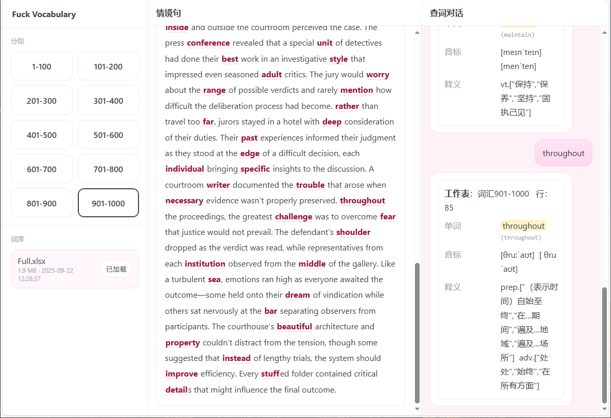

### Fuck Vocabulary — COCA 的 2 万高频词情境记忆

美国当代英语语料库（Corpus of Contemporary American English），简称COCA。2008年，美国杨伯翰大学语言学教授Mark Davies教授创立了美国当代英语语料库，它是当今世界上最大的在线免费英语语料库，能够帮助语言学习者了解单词、短语以及句子结构的使用频率及相关信息。
当代美国英语语料库素材分为 5 种体裁：
口语：电视、广播节目。（8500万词）
小说：1990年至今的小说、故事、电影剧本。（8100万词）
主流杂志：将近100种杂志，内容涉及新闻、健康、家庭、园艺、信仰、体育等。（8600万词）
报纸：美国10家主流媒体。（8100万词）
学术期刊：将近100种主流学术期刊。（8100万词）
COCA 语料库的特点：大、全、新。
根据使用频率选择了前20000个高频词汇，按每 100 个词分组，并为每组配一条完整情境句，目的是飞速且大量积累英语词汇。看完200个句子就能记住20000个词汇，想想就令人激动。每一个词汇，都是来自真实的语言环境。



---

### 快速开始（面向用户）
1) 安装依赖
```powershell
pip install -r requirements.txt
```

2) 启动并打开
```powershell
python app.py
```
- 浏览器访问：`http://127.0.0.1:5000`

---

### 致学习者
词汇是英语的基础。持续积累、反复遇见、在真实语境中理解并运用，是从“认识”走向“会用”的关键。希望这个小工具能帮你在更自然的语境里高效掌握 COCA 2 万高频词。

---

### 关注更新
项目会持续更新。目前更新到1000词，欢迎提issue，一起把它做得更好！如果你觉得有用，请给一个star吧。


